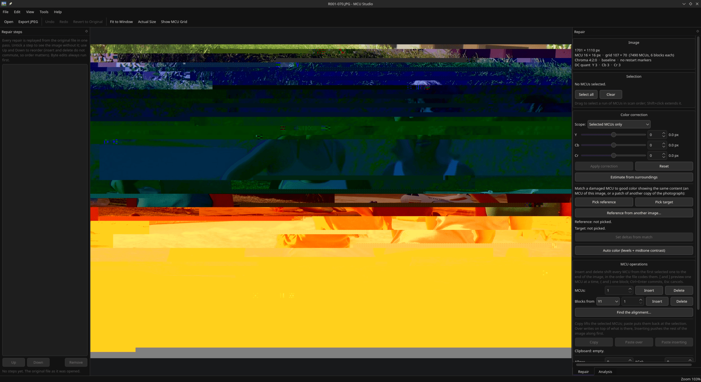

# MCU Studio

**Repair damaged JPEGs at the level they are stored in: the bitstream, the
MCUs and the DCT coefficients, with no re-encoding and no quality loss.**

[](https://isocpp.org/)
[](https://www.qt.io/)
[](LICENSE)

A Qt 6 desktop application, and a command-line tool, for repairing JPEGs
damaged by ransomware encryption (STOP/Djvu and its relatives), truncation,
bad sectors or bit rot: the kinds of damage that knock the entropy-coded stream
out of step, destroy the header, or leave a component's DC level drifting.

MCU Studio works on the units a JPEG is actually stored in. It reads the
Huffman-coded **bitstream** itself, so it can tell where each **minimum coded
unit** (MCU) starts and where decoding went wrong, and it edits bits and bytes
there. It also edits the **DCT coefficients** libjpeg decodes from that stream,
holding them in memory and writing them straight back out. Blocks you did not
touch keep their exact coefficients, so repairing an image never costs a
re-encode generation.

## What a repair looks like

This is the kind of recovery the tool can achieve.



*A 53-step recovery, in four frames. First, the file as it opens: the top of
the picture survives, and below it the stream has lost alignment, so the rest
decodes as the wrong content at the wrong DC level. Second, the same file after
52 steps: 23 MCU inserts and deletes to bring the stream back into alignment,
and 29 DC offsets to pull the color back. Each of those is a coefficient move,
so nothing has been re-encoded. The bands that remain are MCUs whose data is
gone. The third frame selects them (1,434 MCUs in 28 regions, about a fifth of
the picture), and the last shows step 53, an AI fill with the LaMa model
running locally. That content is invented, not recovered. All 53 steps are
still an editable list. (Faces blacked out for this README.)*

## Why the coefficient domain, and the bitstream under it?

Ordinary image editors cannot help with these files. They decode to pixels,
which means every save is a fresh lossy generation over the whole picture, and
they refuse to open the badly damaged files in the first place. The operations
that actually fix a broken JPEG (cut the garbage out of the stream, shift a
component's DC level, insert or delete MCUs to re-align a drifted scan, splice
on a working header) have no expression in the pixel domain at all.

Command-line tools that work at this level exist, but they ask you to guess:
you name a block range and a number, run the tool, open the result, and look.
MCU Studio puts that loop in one window, with the grid you are selecting in, a
live preview of the correction, an editable list of the steps, and searches
that rank the likely fixes for you to preview.

## What it does

- **Reads the bitstream itself.** It maps where every MCU starts and where
  decoding went wrong, and edits bits and bytes there.
- **Finds the likely fixes for you to preview.** A resync search ranks the bit
  and byte edits that put the stream back in step, and an alignment search
  ranks the MCU shifts.
- **Inserts and deletes MCUs and single blocks** to re-align a drifted scan.
- **DC offsets per Y/Cb/Cr component, with live preview**, estimated from the
  surroundings or matched against another copy of the photograph.
- **Fills what is gone.** Paste MCUs from another JPEG, fill from another copy
  in any format, or use AI fill (a local model or an online one) when no other
  copy exists.
- **Donor headers, for files that will not open at all**, with STOP/Djvu files
  recognized and handled.
- **Triage a folder, carve JPEGs out of any file**, and save the previews
  inside a JPEG. Progressive files and trailers (MPF previews, motion photos)
  are understood.
- **The repair is a list, not a result.** Every correction is a step you can
  untick, reorder or drop. The session is saved beside the image on every
  change, and the damaged original is never written over by default.

## Documentation

| Document | Covers |
|---|---|
| [Features](docs/FEATURES.md) | Every tool in detail, and the terms used. |
| [How it works](docs/HOW-IT-WORKS.md) | The engine, why damage looks the way it does, donor headers, fills, color matching, performance. |
| [Building](docs/BUILDING.md) | Prerequisites, build options, tests, source layout. |

## Installing

### Arch Linux

```sh
paru -S mcu-studio     # or your AUR helper of choice
```

The `PKGBUILD` also lives in [`packaging/aur`](packaging/aur).

### Other Linux distributions

Download `McuStudio-<version>-x86_64.AppImage` from the
[latest release](https://github.com/TheGameratorT/mcu-studio/releases), make
it executable and run it:

```sh
chmod +x McuStudio-*-x86_64.AppImage
./McuStudio-*-x86_64.AppImage
```

It is one file carrying the application, Qt and ONNX Runtime (for AI fill's
local model), and nothing is installed. It needs an x86_64 distribution with
glibc 2.35 or newer (Debian 12, Ubuntu 22.04, Fedora 36 and later). See
[`packaging/appimage`](packaging/appimage/README.md) for how it is built.

### Windows

Download `McuStudio-<version>-Setup.exe` from the
[latest release](https://github.com/TheGameratorT/mcu-studio/releases). It is a
single installer carrying the application, the command-line tool and the Qt
runtime, and it adds an "Open with MCU Studio" entry to the JPEG context menu
without taking over as the default handler. See
[`installer/`](installer/README.md) for how it is built.

## Building

Needs CMake 3.21+, a C++17 compiler, Qt 6.2+ and libjpeg-turbo. ONNX Runtime
is optional, both to build and to run (AI fill's local model).

```sh
cmake -S . -B build -DCMAKE_BUILD_TYPE=Release
cmake --build build
ctest --test-dir build --output-on-failure
./build/bin/mcu-studio [image.jpg]
```

See [Building](docs/BUILDING.md) for the dependencies per platform, the build
options and the tests.

## Command line

`mcu-studio-cli` is the same core without a window:

```sh
mcu-studio-cli info photo.jpg                  # what it is and what is wrong with it
mcu-studio-cli triage ~/rescued --csv out.csv  # sort a folder by what is wrong
mcu-studio-cli resync photo.jpg -o fixed.jpg   # find the edit that resynchronizes the stream
mcu-studio-cli splice ~/encrypted --donor sibling.jpg -o ~/spliced
                                               # one donor onto a folder of STOP/Djvu files
mcu-studio-cli apply photo.jpg.mcup --report   # export a session's repair
mcu-studio-cli carve disk.img -o ~/carved      # every complete JPEG in any file
mcu-studio-cli extract photo.jpg -o ~/previews # the thumbnail and previews inside a JPEG
mcu-studio-cli bench photo.jpg                 # time the engine on your machine
```

`info`, `triage` and `resync` take `--json`.

## Contributing

Bug reports and pull requests are welcome. For major changes, please open an
issue first to discuss what you would like to change.

## License

**GNU General Public License v3.0**, see [LICENSE](LICENSE).

This tool includes a modified copy of
[jpegrepair](https://github.com/openrightorg/jpegrepair) by Don Mahurin
(BSD 3-Clause), marker-copying helpers from the Independent JPEG Group, and a
preview decoder that reimplements IJG algorithms. See
[THIRD-PARTY-NOTICES.md](THIRD-PARTY-NOTICES.md) for the notices and a list of
the changes made.