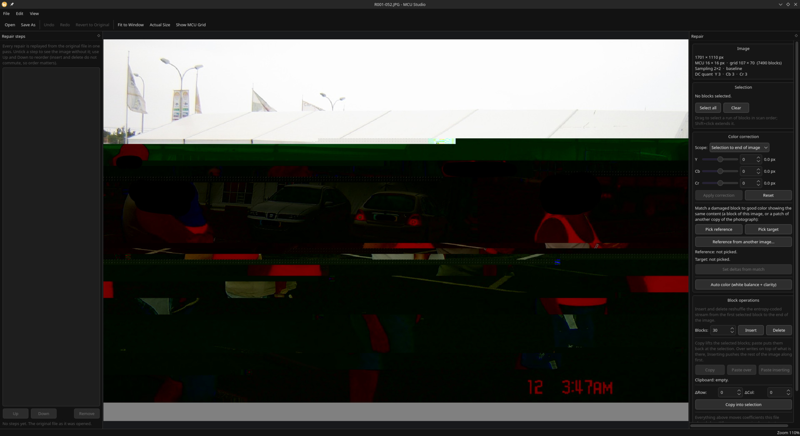
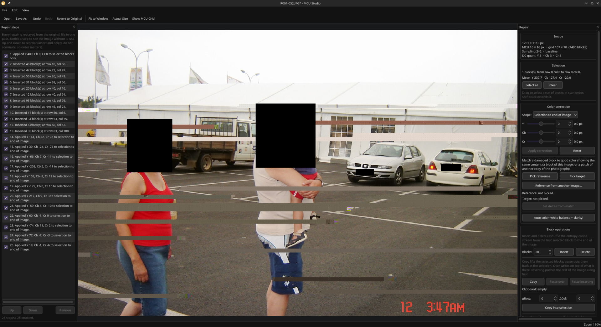
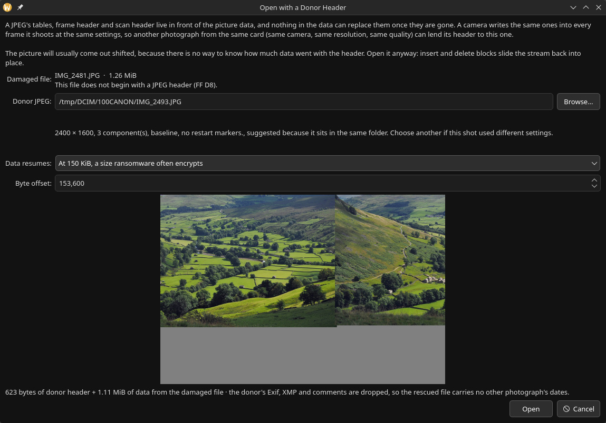

# MCU Studio

**Repair damaged JPEGs by editing their DCT coefficients directly, with no
re-encoding and no quality loss.**

[](https://isocpp.org/)
[](https://www.qt.io/)
[](LICENSE)

A Qt 6 desktop application for repairing JPEGs damaged by ransomware encryption
(STOP/DJVU and its relatives), truncation, or bit rot: the kinds of damage that
shift the entropy-coded stream out of alignment or wreck a component's DC level.

MCU Studio works at the level a JPEG is actually stored in, the **minimum coded
unit** (MCU) and the **DCT coefficients** inside it. Corrections are applied to
`jpeg_read_coefficients` arrays and written straight back out, so blocks you did
not touch keep their exact coefficients and decode to precisely the pixels they
did before. Repairing an image never costs a re-encode generation.

## What a repair looks like

This is the kind of recovery the tool can achieve.



*The file as it opens. The top of the picture survives; below it the stream has
lost alignment, so the rest decodes as the wrong content at the wrong DC level.*



*The same file after 25 steps: twelve block inserts to bring the stream back
into alignment, thirteen DC offsets to pull the color back. Every step is a
coefficient move, so nothing here has been re-encoded. A few bands of damage
remain, and the repair steps that produced this are still an editable list.
(Faces blacked out for this README.)*

## Why the coefficient domain?

Ordinary image editors cannot help with these files. They decode to pixels,
which means every save is a fresh lossy generation over the whole picture, and
they refuse to open the badly damaged files in the first place. The operations
that actually fix a broken JPEG (shift a component's DC level, insert or delete
blocks to re-align a drifted scan, splice on a working header) have no
expression in the pixel domain at all.

Command-line tools that do work at this level exist, but they ask you to guess:
you name a block range and a number, run the tool, open the result, and look.
MCU Studio puts that loop in one window, with the grid you are selecting in, a
live preview of the correction, and an editable list of the steps.

## Features

- **Donor headers, for files that will not open at all.** Ransomware, a bad
  sector or a truncation takes the front of the file, and nothing in the
  surviving picture data can replace it. Another photograph from the same card
  carries the same header, so it can lend its own. The tool suggests a donor,
  ranks its guesses at where the surviving data resumes, and previews each one,
  so a wrong guess costs a click. The donor's Exif, XMP and comments are dropped
  on the way through, so a rescued photograph never inherits another shot's date
  or GPS fix.
- **DC offsets per Y/Cb/Cr component, with live preview.** A constant added to
  the quantized DC coefficient of every block in scope: the fix for a component
  whose level has drifted. The panel calibrates the offset against the image's
  own DC quantization step and shows what shift it produces in 0-255 sample
  terms. Scope is the selection, the selection to the end of the image, or the
  whole image, and all three are lossless.
- **Automatic color matching.** Pick a block showing good color and a block
  showing the damage, and the tool derives the offsets. It warns when either
  block has clipped samples (the match will fall short) or when the two differ
  so much they probably are not the same content.
- **Reference color from another copy of the photograph.** A transplanted header
  can leave nothing to match against *inside* the file, since the picture may be
  the wrong color from its very first block. Point the tool at any surviving
  copy instead (a thumbnail, a gallery cache, a backup, JPEG or not) and drag a
  box over the matching content. Color survives being shrunk, so a small or soft
  copy does the job, and only three numbers cross over: none of that file's
  pixels reach the repair.
- **Block insert, delete and copy**, plus an MCU clipboard: the classic fix for
  a stream that has lost or gained bytes. Selections run in scan order rather
  than as a rectangle, because that is the order damage propagates in.
- **Filling blocks from another copy of the photograph.** Every repair above
  moves coefficients the file already has. Where it has none left (an
  overwritten stretch, a hole a truncation left), another copy can supply the
  content, in any format the system can read, because what comes across is
  pixels rather than blocks. See
  [below](#filling-blocks-from-a-picture-that-is-not-a-jpeg) for what that costs
  and where the cost lands.
- **Auto color:** white balance (a per-channel histogram stretch) plus a curve
  that adds midtone contrast. This one is a pixel edit, so it re-encodes, and
  the tool says so before it runs.
- **Metadata and dates survive the repair.** Exif, ICC, XMP and comment markers
  are carried into the output, auto color included, and the exported file is
  stamped with the original's modification and access times, so a rescued folder
  still sorts by when the photos were taken.
- **The repair is a list, not a result.** Every correction lands as a step in a
  side panel, and the image you see is the original file with the ticked steps
  replayed over it in a single pass. Untick one to see the picture without it,
  reorder them, drop one from the middle, and the rest still apply. Undo/redo
  works over the whole session, and clearing the list gives back the original.
- **There is no Save.** Because the repair is a list, it is small enough to
  write down as you work, and that is what happens: a `.mcup` project file
  appears beside the image and is rewritten on every change. Reopen the
  photograph and the session comes back where you left it — steps, ticks, order
  and all — whether you closed the program or it closed on you. What you export
  is the repaired JPEG, which is a product of the session rather than the
  session itself, so it is asked for explicitly and never written over the
  damaged original by default.

<details>
<summary>Replaying from the original is also what keeps insert and delete honest</summary>

When an image's width is not a multiple of the MCU width, the coefficient array
carries a column of dummy blocks past the right edge, and libjpeg overwrites
them on the way out with a DC-only copy of their neighbor: same DC, all AC
zeroed. That happens on *every* write, not just a re-encode, because
`jpeg_write_coefficients` refills the dummy blocks even when nothing was decoded
to pixels. On its own it costs nothing, since those blocks are outside the
visible image and the decoder crops them away. Insert and delete are what make
it matter: they shift the stream *through* those positions, so real picture data
lands in the dummy column and is flattened by the write. Under an
edit-and-reapply model the next insert would then drag those flattened blocks
back into view as a stripe of detail-less squares. Replaying from the original
keeps the session to a single write, so the dummy column is only ever clobbered
on the final export, with nothing left to shift it into view.

</details>

## Installing

### Arch Linux

```sh
paru -S mcu-studio     # or your AUR helper of choice
```

The `PKGBUILD` also lives in [`packaging/aur`](packaging/aur).

### Windows

Download `McuStudio-<version>-Setup.exe` from the
[latest release](https://github.com/TheGameratorT/mcu-studio/releases). It is a
single installer carrying the application and its Qt runtime, and it adds an
"Open with MCU Studio" entry to the JPEG context menu without taking over as
the default handler. See [`installer/`](installer/README.md) for how it is built.

## Building

### Prerequisites

- CMake 3.21+
- A C++17 compiler
- Qt 6.2+ (`Widgets`, `Concurrent`)
- libjpeg or libjpeg-turbo, with development headers

<details>
<summary>Installing dependencies</summary>

```sh
# Arch
sudo pacman -S cmake qt6-base libjpeg-turbo

# Debian / Ubuntu
sudo apt install cmake qt6-base-dev libjpeg-dev

# Fedora
sudo dnf install cmake qt6-qtbase-devel libjpeg-turbo-devel

# macOS
brew install cmake qt libjpeg-turbo

# Windows (MSYS2 MINGW64)
pacman -S mingw-w64-x86_64-{gcc,cmake,ninja,qt6-base,qt6-tools,libjpeg-turbo}
```

</details>

### Build and run

```sh
cmake -S . -B build -DCMAKE_BUILD_TYPE=Release
cmake --build build
./build/bin/mcu-studio [image.jpg]
```

## How it works

### DC offsets

A DC offset adds a constant `dC` to the **quantized** DC coefficient of every
block in scope. The dequantized DC therefore moves by `dC × Q00`, and because
the JPEG DCT normalizes the DC term to eight times the block's mean sample,
every sample in the block moves by:

```
dC × Q00 / 8
```

`Q00` is the DC entry of that component's quantization table, read from the
image itself. It differs per component and per quality level, which is why the
tool reads it rather than assuming `dC / 8`. (In the vendored jpegrepair
library this operation is the one its command line calls `cdelta`.)

### Block operations

Insert and delete shift blocks forward or backward through the entropy-coded
stream from the selected block onward, re-aligning a scan that has drifted.
Copy replaces each selected block with one a fixed number of MCUs away, and the
clipboard lifts a run of whole MCUs out and writes it back somewhere else.

### Donor headers



*Opening a file whose first 150 KiB were destroyed, with another shot from the
same camera roll standing in as the donor. The preview is the splice decoded:
the surviving picture comes back shifted, because there is no way to know how
much data went with the header, and it runs out early, because the overwritten
bytes are gone for good. Insert and delete are what move the rest into place.*

A transplant is the donor's bytes from `SOI` through the end of its `SOS`
segment, followed by the damaged file's bytes from a chosen offset on. Choosing
that offset is the whole problem, because the damage has no marker at its end.
The tool offers, in order:

1. **Byte 0**, the default. It drops nothing and assumes nothing, and it is
   right whenever the header was lost rather than overwritten: a zeroed front,
   a carved fragment, a file that starts mid-scan.
2. **Right after the file's own scan header**, when part of the header
   survived. The donor then supplies only the tables libjpeg choked on.
3. **The first restart marker past the damage.** These are the ideal entry
   points, because the encoder flushed to a byte boundary and reset its DC
   predictors at each one, so data after a restart decodes correctly with no
   knowledge of what came before. Many cameras write none, and the option says
   so when it is not available rather than quietly vanishing.
4. **Just past the last byte pair no valid JPEG could contain.** Inside a scan
   every `FF` is stuffed (`FF 00`), a restart marker, padding, or the `EOI`.
   Encrypted or random bytes break that rule roughly every 250 bytes, so the
   last violation in the file bounds the damage tightly.
5. **150 KiB and 624 KiB**, prefix lengths that STOP/DJVU and its relatives are
   reported to encrypt.

None of these can be verified from the bytes, so each is judged by decoding it:
the dialog splices, decodes and shows the result, and refuses to open a
combination that does not decode at all. A donor whose tables do not match will
usually decode into confetti rather than fail outright, which is why the
preview, not a compatibility check, is the thing standing between you and a bad
transplant.

### Filling blocks from a picture that is not a JPEG

Copying MCUs between two JPEGs can be lossless, and within one file it always
is: coefficients are lifted and written back as integers, and nothing
dequantizes them on the way. Across two files it holds only where the
quantization tables and sampling factors match, since a coefficient is an index
into a table rather than a value, and the same number means a different amount
under someone else's tables. That is what the clipboard's cross-file warning is
about.

A PNG has no coefficients at all, so nothing can be lifted from it. Its pixels
have to be color converted, chroma downsampled, transformed and quantized
before a JPEG can hold them, and no arrangement of that is lossless. What can be
bounded is where the loss lands:

1. The selection's bounding box is expanded to whole MCUs, which it already is,
   so the patch's block boundaries fall exactly on the file's own.
2. That rectangle of the reference is handed to libjpeg's encoder configured
   from the damaged file's header (its quantization tables, its sampling
   factors, its color space) and the quantized blocks are read straight back
   out. They are the blocks the file would have stored for that content.
3. Those blocks are written into the coefficient array in place of the selected
   ones, and the stream is re-emitted exactly as any other repair re-emits it.

Step 3 is the ordinary coefficient-domain path, so every block the selection
does not name keeps its exact coefficients. That is checkable rather than
claimed: reading every MCU before and after a fill shows changes only inside the
selection, and zero outside it.

Pixels just outside the patch can still shift by a level or two, and this is not
a re-encode leaking. Chroma is stored at half resolution, so the decoder
interpolates each chroma sample across its neighbors on the way out, and a
changed block at the boundary therefore changes the pixel column beside it. The
coefficients there are untouched: it is the decoder reading a new neighbor.

### Matching color against another copy

Everything the match arithmetic touches is measured in YCbCr, which is what
makes a second file usable: those are the samples a JPEG actually stores, and a
mean over them is absolute. Two copies of a photograph need no shared
resolution, quality or quantization tables for their means to be comparable,
which is just as well, since a thumbnail shares none of them. A reference that
did not come out of a JPEG at all is converted with JFIF's full-range matrix,
the same one libjpeg's decoder applies.

What geometry cannot do is find the content for you. The tool will scale the
target block's position into the other copy and put the box there, but a
transplanted header leaves the stream shifted by an unknown number of MCUs, so
until insert and delete have put it back, the block at a given position is
showing something from elsewhere in the picture. The box is meant to be dragged
onto matching content by eye, with the mean and its color re-read as it moves.

## Performance

The repair code is linked in as a library rather than driven as a subprocess, so
a whole operation list is applied to a single coefficient read instead of one
process launch and one temporary-file round trip per operation. On a 3888×2592
image, a three-channel correction applies in ~38 ms and a full preview (apply
plus decode) takes ~69 ms. Previews are debounced and rendered off the UI
thread, so dragging a slider stays responsive.

## Layout

```
src/                        the Qt 6 application
third_party/jpegrepair/     vendored jpegrepair, built as a library
packaging/                  desktop entry, icons, AUR PKGBUILD
installer/                  Windows NSIS installer
docs/screenshots/           the images used above
.github/workflows/          CI and releases
```

## Contributing

Bug reports and pull requests are welcome. For major changes, please open an
issue first to discuss what you would like to change.

## License

**GNU General Public License v3.0**, see [LICENSE](LICENSE).

This tool includes a modified copy of
[jpegrepair](https://github.com/openrightorg/jpegrepair) by Don Mahurin
(BSD 3-Clause) and marker-copying helpers from the Independent JPEG Group.
See [THIRD-PARTY-NOTICES.md](THIRD-PARTY-NOTICES.md) for the notices and a list
of the changes made.
