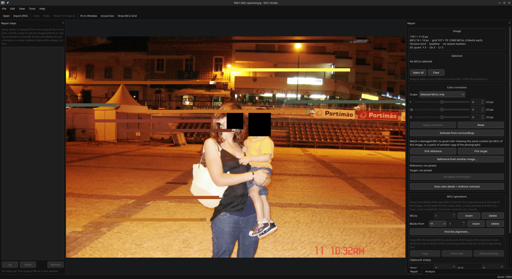

# How it works

The reasoning behind the tools listed in [Features](FEATURES.md), which also
defines the terms used here.

## The engine

The file is entropy-decoded once, into coefficients held in memory MCU by MCU,
in the order the stream codes them. After that an MCU shift is a `memmove`, a
DC offset is a loop over DC terms, and the screen is brought up to date by
decoding only the MCU rows whose coefficients changed. The decoder that does
this reimplements libjpeg's accurate integer IDCT, its "fancy" chroma upsampling
and its JFIF color conversion. Its output is identical, sample for sample, to
libjpeg-turbo decoding the exported file: the test suite checks this across
sampling layouts, odd sizes and progressive files. (Where a block is overdriven
past black or white, it saturates the way libjpeg-turbo's SIMD decoders and so
ordinary viewers do.) The Huffman encoder runs only when a file is exported.

Edits never clip. Coefficients are stored as the damaged stream decoded them
and as your corrections leave them, however far out of range, so corrections
can be stacked, overshot and taken back exactly. What a JPEG can actually hold
(AC terms within ±1023, and each DC within an 11-bit step of the one before it)
is applied only on the way out, by the preview and the export alike.

## DC offsets

A DC offset adds a constant `dC` to the **quantized** DC coefficient of every
block in scope. The dequantized DC therefore moves by `dC × Q00`, and because
the JPEG DCT normalizes the DC term to eight times the block's mean sample,
every sample in the block moves by:

```
dC × Q00 / 8
```

`Q00` is the DC entry of that component's quantization table, read from the
image itself. It differs per component and per quality level, which is why the
tool reads it rather than assuming `dC / 8`. DC values are clamped to the range
an 8-bit Huffman coder can write.

## Why damage looks the way it does

The DC coefficient is coded as a difference from the previous block's. When a
few bits are lost or garbage is inserted, the decoder reads nonsense for a
while, usually falls back into step on its own (Huffman codes resynchronize),
and from then on decodes the right data. But every block after the damage sits
at the wrong position, by however many blocks the garbage decoded as, and at
the wrong DC level, by whatever the garbage's DC differences summed to. Inserting
and deleting MCUs and adding DC offsets approximates the fix. Cutting the
garbage out of the stream is the exact fix, and the resync search finds it.
Without restart markers the error persists to the end of the image; with them,
to the next marker, where the encoder reset its predictors.

## Donor headers


*Opening a file whose first 150 KiB were destroyed, with another shot from the
same camera roll standing in as the donor. The preview is the splice decoded:
the surviving picture comes back shifted, because there is no way to know how
much data went with the header, and it runs out early, because the overwritten
bytes are gone for good. Insert and delete are what move the rest into place.*

A transplant is a header assembled from the donor, and from the damaged file
where its own header survives, followed by the damaged file's bytes from a
chosen offset on. Choosing that offset is the whole problem, because the damage
has no marker at its end. The tool offers, in order:

1. **Byte 0**, the default. It drops nothing and assumes nothing, and it is
   right whenever the header was lost rather than overwritten: a zeroed front,
   a carved fragment, a file that starts mid-scan.
2. **Right after the file's own scan header**, when part of the header
   survived. The file's own surviving tables are kept, and the donor supplies
   the rest.
3. **The first restart markers past the damage.** The data after one decodes
   correctly, because the encoder byte-aligned the stream and reset its DC
   predictors there. Which interval it is cannot be known from the marker,
   since markers count modulo 8, so the picture may still need shifting by
   whole intervals. The markers are renumbered so the first is RST0, or libjpeg
   would insert or skip an interval. Many cameras write no restart markers, and
   the option says so when it is not available rather than quietly vanishing.
4. **Just past the last byte pair no valid JPEG could contain.** Inside a scan
   every `FF` is stuffed (`FF 00`), a restart marker, padding, or the `EOI`.
   Encrypted or random bytes break that rule roughly every 250 bytes, so the
   last violation bounds the damage tightly. The search stops at the image's own
   end, ignoring a trailing preview or ransomware footer.
5. **150 KiB**, the prefix STOP/Djvu encrypts, and the first restart marker
   after it.

None of these can be verified from the bytes, so each is judged by decoding it:
the dialog splices, decodes and shows the result, and refuses to open a
combination that does not decode at all.

## Filling MCUs from a picture that is not a JPEG

Copying MCUs between two JPEGs can be lossless, and within one file it always
is: coefficients are lifted and written back as integers. Across two files it
holds only where the quantization tables and sampling factors match, since a
coefficient is an index into a table rather than a value. Where the tables
differ, pasting converts the coefficients to this file's tables.

A PNG has no coefficients at all. Its pixels have to be color converted, chroma
downsampled, transformed and quantized before a JPEG can hold them, and no
arrangement of that is lossless. What can be bounded is where the loss lands:
the selection's MCUs are handed to libjpeg's encoder configured with the damaged
file's own quantization tables and sampling factors, and the resulting blocks
are written into the coefficient array in place of the selected ones. They are
in the same currency as their neighbors. A camera's own encoder would have
rounded and downsampled a little differently, so they are not the blocks the
camera would have written. Every MCU outside the selection keeps its exact
coefficients. Pixels just outside the patch can still shift by a level or two,
because the decoder interpolates chroma across the boundary.

## AI fill

When no other copy of the photograph exists, the missing part can only be made
up. AI fill asks a model to do that and then puts the answer through the same
door as a reference picture: only the selected MCUs are quantized, with the
file's own tables, and written as one step. The coefficients go into the
project file, so reopening or undoing a repair never runs a model again.



The selection is cut into windows a model can take. Each window is sent with a
mask of what is wanted, the answers are laid back under the selection and
nowhere else, and later windows see what earlier ones produced. The mask
reaches two pixels past the selected MCUs, because a damaged MCU's chroma
bleeds that far into its neighbors when decoded, and a model shown that fringe
continues its color through the gap.

Two kinds of model are supported, and they are good at different things:

| Model | Where it runs | What it is good at |
|---|---|---|
| **LaMa** | Inside MCU Studio, on the CPU, through ONNX Runtime (a 200 MB model, downloaded on request) | Continuing what is around the gap: sand, sky, foliage, skin. Seconds per region, no setup. Good for thin gaps, one or two MCU rows, even across a face; over taller gaps it smooths detail away. |
| **Online image model** | A service speaking the OpenAI Images API, with your key | Drawing what is missing: a face, a hand, an edge that has to continue. Takes a short description. The window around each region is uploaded, which the tool states and asks about first. |

A model that redraws the whole window rather than only the hole returns it
slightly moved and recolored. Before any of it is used, the answer is fitted
back over the original using the real pixels beside the hole (a shift of up to
12 pixels and a gain and offset per channel), and the tool warns when the fit
is poor.

## Matching color against another copy

Everything the match arithmetic touches is measured in YCbCr, which is what
makes a second file usable: those are the samples a JPEG actually stores, and a
mean over them is absolute. Two copies of a photograph need no shared
resolution, quality or quantization tables for their means to be comparable. A
reference that did not come out of a JPEG at all is converted with JFIF's
full-range matrix, the same one libjpeg's decoder applies.

## Performance

`mcu-studio-cli bench` times the engine on a given file. On a 3888×2592 4:2:0
JPEG (2.5 MB), on a 4-thread x86-64 cloud VM with distribution libjpeg-turbo
2.1, best of 5 runs:

| Stage | ms |
|---|---:|
| Load (entropy decode, once per file) | 72 |
| DC offset on 3 components, whole image | 5 |
| Insert 3 MCUs mid-image | 0.8 |
| Decode the whole picture (all threads) | 24 |
| Decode one MCU row (what most edits need) | 0.6 |
| Preview a DC edit on 64 MCUs (copy, edit, decode the changed rows) | 39 |
| Write the JPEG (export only) | 85 |
| *For comparison: libjpeg-turbo's own full decode, one thread* | *70* |
| *The previous pipeline, read+edit+write per preview, before decoding* | *164* |

Previewing a DC offset or a shift, and the resync search, run off the UI
thread. Committing a step, and previewing a candidate byte edit (which re-reads
the stream), run on it at the costs above.
